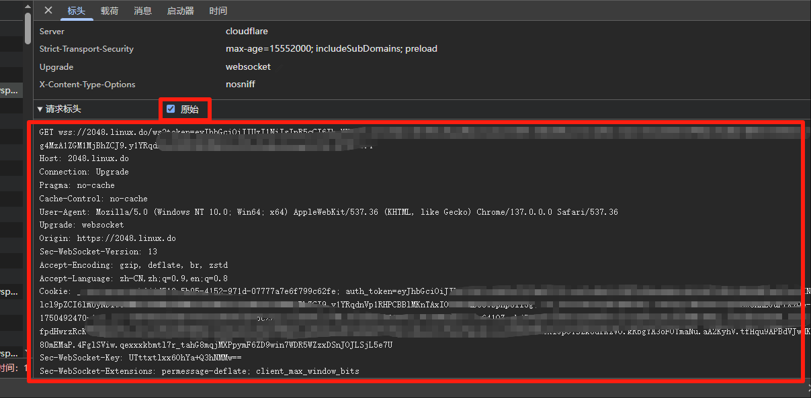
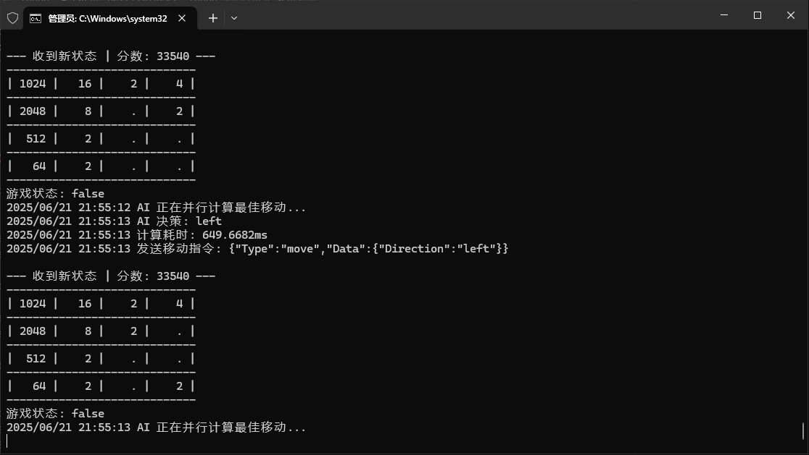

# L2048DO

🎮 LinuxDo 专属 2048 游戏自动化脚本。

[](https://github.com/jwwsjlm/l2048do/releases)
[](LICENSE)
[](https://golang.org)

---

## ✨ 功能特性

- 🎮 **2048 自动化** - 自动玩 2048 游戏
- 🔄 **分数延续** - 支持跨会话继续游戏
- ⚡ **CPU 优化** - 自动优化 CPU 使用
- 🌐 **WebSocket** - 基于 WebSocket 连接

---

## 🚀 快速开始

### 下载程序

从 [Releases](https://github.com/jwwsjlm/l2048do/releases) 下载最新版本

### 运行

```bash
./2048.exe --path http.txt --depth 1 --reset false
```

---

## 📖 使用说明

### 参数说明

| 参数 | 说明 | 默认值 |
|------|------|--------|
| `--path` | HTTP 请求文件路径 | http.txt |
| `--depth` | 搜索步数 | 1 |
| `--reset` | 是否每次重新开始 | false |

### 分数延续

- `--reset=false`：延续上一局的分数
- `--reset=true`：每次运行重新开始

**使用场景：**
- 临时有事？关闭程序，下次继续
- 分数会累加，不会丢失

---

## ⚙️ 配置说明

### http.txt 文件格式

1. 打开浏览器开发者工具
2. 找到 WebSocket 请求
3. 选择请求头，勾选"原始"
4. 全选复制内容到 `http.txt`
5. **重要：** 最后打两个回车换行

**示例：**
```
GET /ws HTTP/1.1
Host: example.com
...

(两个空行)
```

---

## ⚠️ 常见问题

### 链接失败

**原因：** IP 被 Cloudflare 风控

**解决方法：**
1. 更换 IP
2. 打开 Cloudflare 验证
3. 访问 linuxdo 手动过几次验证

---

## 🛠️ 技术栈

- **WebSocket:** [gorilla/websocket](https://github.com/gorilla/websocket)
- **CPU 优化:** [go.uber.org/automaxprocs](https://go.uber.org/automaxprocs)
- **AI 辅助:** Gemini 2.5 Pro

---

## 📸 运行截图

### 游戏界面


### 运行状态


---

## 📄 许可证

MIT License

---

## 📬 联系方式

- GitHub: [@jwwsjlm](https://github.com/jwwsjlm)
- 博客：https://blog.xsojson.com

---

**如果有帮助，欢迎 Star ⭐️！**
